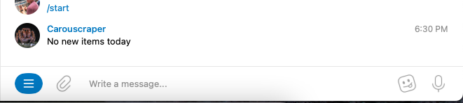

Carouscraper

My attempt at learning github actions and its associated CRON features.

I am using this to run a python webscraping script for a new monitor. Each new post will be sent to a telegram chat of mine with a quick link for new listings. The hope is to beat the game with speed and also unlock new potentials for similar CRONs.

* [ ] Scrapes up to 150 listings on carousell's website
* [ ] Filters the listings by price and removes bottom 3 percentile (scams)
* [ ] Sorts posts based on time posted as well as bump status
* [ ] Posts posted today will be send to telegram along with the link and price for quick access booking

Future updates might include having a setting set via a user-written pickle file to change queries in order to personalise the search and filter terms in the scraping script

1. *request post feature for autonomous bookings*
2. *.pk files to be written saved and retrieved for user settings*
3. *dynamic filters and sorting functions*
